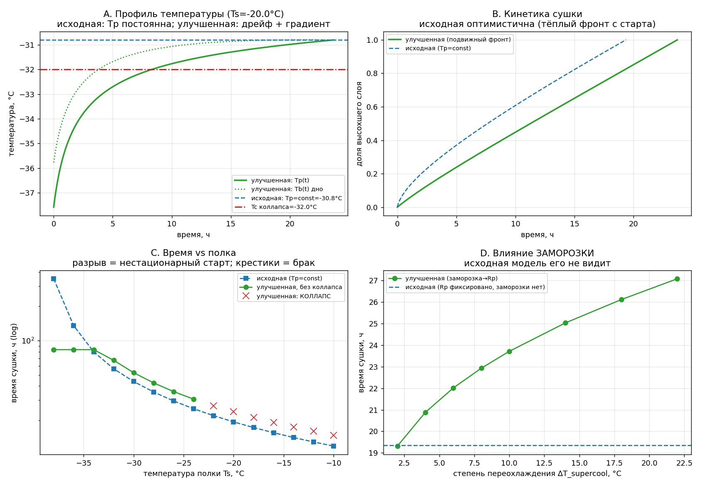
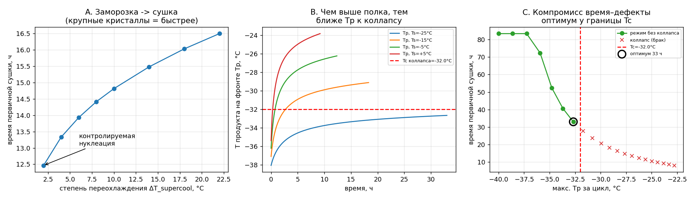
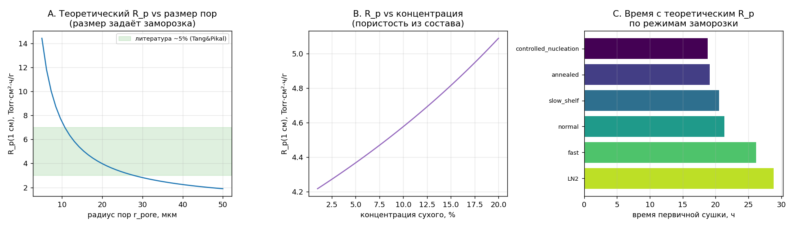

# Физически обоснованная модель режима лиофилизации

Расширение модели **Tang & Pikal, «Design of Freeze-Drying Processes for
Pharmaceuticals: Practical Advice»** (Pharm. Res. 2004) с целью точнее подбирать
эффективный режим: **минимум времени первичной сушки при отсутствии дефектов
(коллапса)**.

Учтены замечания из литературы (Ronzi 2003 — коллапс Factor VIII/IX; Kumar 2024 —
стрессы заморозки, controlled nucleation, scale-up).

---

## 1. Идеи (что и зачем добавлено)

| # | Идея | Физический смысл | Чего нет в исходной модели |
|---|------|------------------|----------------------------|
| 1 | **Подвижный фронт сублимации (задача Стефана)** | Лёд уходит сверху вниз; между дном флакона и фронтом стоит слой льда с перепадом температуры | Исходная — 0-D, одна `Tp`, градиент свёрнут в поправку `l_ice/k1` |
| 2 | **Коллапс через вязкость**, привязанный к измеряемой `Tc` | Высохший freeze-concentrate выше `Tc` течёт и закрывает поры быстрее ухода фронта | Исходная коллапс не моделирует, `Tc` — внешнее ограничение |
| 3 | **Связь «заморозка → R_p»** | Переохлаждение → размер кристаллов льда → пористость → сопротивление сухого слоя | Исходная берёт `R_p` как фиксированный вход |
| 4 | **Динамика во времени** | `Tp(t)` дрейфует: старт лимитирован теплом, финал — массопереносом | Исходная держит `Tp = const` (целевую) весь процесс |

---

## 2. Конкретные улучшения относительно базовой линии (Tang & Pikal)

| Аспект | Базовая модель (Tang & Pikal) | Что изменено здесь | Эффект (расчёт) |
|--------|-------------------------------|--------------------|-----------------|
| **Температура продукта** | `Tp` принимается **постоянной** = целевой на весь процесс | `Tp(t)` **вычисляется** на каждом шаге из связанного тепло-массобаланса | Видно занижение времени базовой моделью **~18 %** (панель B) |
| **Размерность по координате** | 0-D (сосредоточенная), теплопроводность льда — одна алгебраическая поправка `l_ice/k1` | 1-D **задача Стефана**: фронт `H(t)` движется, лёд `L₀−H` тает | Явный градиент `T_b − T_p ≈ 1–4 °C`, растущий с подводом тепла |
| **Сопротивление `R_p`** | Константа / из номограммы (Fig. 1–3) | `R_p(H)` зависит от **текущего фронта** + множитель морфологии льда | `R_p` эволюционирует по ходу сушки, а не фиксирован |
| **Заморозка** | Только эмпирические протоколы (скорость ~1 °C/мин, выдержки) — **без связи** с сушкой | Степень переохлаждения → размер кристаллов → `R_p` (`f_cryst`) | Время сушки 19→27 ч при ΔT_sc 2→22 °C (панель D) |
| **Коллапс** | Ручное ограничение «держать `Tp < Tc`» | Механистическое **число коллапса** `Co = η(Tc)/η(Tp)` по траектории `Tp(t)` | Авто-сигнал брака там, где база даёт «быстрый» режим (панель C) |
| **Расчёт времени** | Номограмма: `t ∝ толщина / (Ts − Tp)`, «crude» (сами авторы) | Интеграл `t = ∫ ρ/J_s(H) dH` по связанной нестационарной системе | Время — результат физики, а не оценка по графику |
| **Давление пара льда** | Используется неявно | Явная формула Murphy & Koop (2005) | Точное термодинамическое свойство |
| **Способ использования** | **Обратный**: задать `Tp` → найти нужную `Ts` (ур. 5) | **Прямой**: задать `Ts(t), P_c(t)` → получить `Tp(t)`, время, риск коллапса | Прямое моделирование произвольного профиля полки |

`K_v` (ур. 6) **сохранён без изменений** — это валидное полу-эмпирическое свойство аппарата.

---

## 3. Модифицированные формулы (база → модификация)

### 3.1 Тепловой баланс: сворачивание $T_s$ (ур. 5) → две явные транспортные связи

**База (Tang & Pikal, ур. 5)** — одно алгебраическое выражение, $T_p$ и $l_{ice}$ приняты $\approx \text{const}$:

$$T_s = T_p + \frac{1}{A_v}\cdot\frac{dQ}{dt}\cdot\left(\frac{1}{K_v} + \frac{l_{ice}}{k_1}\right)$$

**Модификация** — разбито на два явных потока с **подвижной** толщиной льда $L_0 - H$:

$$J_s\cdot\Delta H_{sub} = K_v\cdot\frac{A_v}{A_p}\cdot(T_s - T_b)$$

$$J_s\cdot\Delta H_{sub} = \frac{k_{ice}}{L_0 - H}\cdot(T_b - T_p)$$

Первое уравнение — поток тепла «полка → дно флакона», второе — «дно → фронт через
слой льда». Теперь $T_b$ и $T_p$ — **разные** искомые, а проводимость льда
$k_{ice}/(L_0-H)$ меняется во времени.

### 3.2 Массоперенос (ур. 1): $R_p=\mathrm{const}$ → $R_p(H)$ + заморозка

**База (ур. 1):**

$$\frac{dm}{dt} = \frac{P_{ice} - P_c}{R_p + R_s}, \qquad R_p = \mathrm{const}$$

(в базовой модели $R_p$ берётся из номограммы)

**Модификация** — $R_p$ зависит от текущего фронта $H$ и режима заморозки:

$$J_s = \frac{P_{ice}(T_p) - P_c}{R_p(H)}, \qquad R_p(H) = f_{cryst}\left[R_{p0} + \frac{A_1\cdot H_{cm}}{1 + A_2\cdot H_{cm}}\right]$$

### 3.3 НОВОЕ: связь заморозка → сопротивление

Нет аналога в базе. Масштаб дендритного расстояния $\lambda \sim \Delta T^{-1/2}$:

$$f_{cryst} = \left(\frac{\Delta T_{sc}}{\Delta T_{ref}}\right)^{1/2}$$

Сильное переохлаждение $\Rightarrow$ мелкие кристаллы $\Rightarrow$ выше $R_p$ $\Rightarrow$ медленнее сушка.

### 3.4 НОВОЕ: механистический коллапс вместо правила $T_p < T_c$

**База:** качественное правило «$T_p$ на несколько °C ниже $T_c$».
**Модификация** — вязкость freeze-concentrate (WLF) + число коллапса:

$$\eta(T) = \eta_g\cdot 10^{-\dfrac{C_1\cdot(T-T_g')}{C_2 + (T-T_g')}}, \qquad \eta_g \approx 10^{12}\ \mathrm{Pa\cdot s}$$

$$Co = \frac{\eta(T_c)}{\eta(T_p)}, \qquad Co \ge 1 \iff T_p \ge T_c$$

$Co \ge 1$ означает коллапс.

### 3.5 НОВОЕ: уравнение движения фронта (динамика)

Нет аналога в базе (там — оценка по номограмме). Интегрируется во времени:

$$\frac{dH}{dt} = \frac{J_s}{\rho_{cake}}, \qquad t = \int_0^{L_0} \frac{\rho_{cake}}{J_s(H)}\ dH$$

### 3.6 Свойство: давление насыщенного пара надо льдом (Murphy & Koop 2005)

$$\ln P_{ice}\ [\mathrm{Pa}] = 9.550426 - \frac{5723.265}{T} + 3.53068\cdot\ln T - 0.00728332\cdot T, \qquad T\ [\mathrm{K}]$$

Константы: $\Delta H_{sub} = 2.84\times10^{6}$ Дж/кг, $k_{ice} = 2.30$ Вт/(м·К), $\rho_{cake} \approx 900$ кг/м³.

### 3.7 Сохранено из базы без изменений: коэффициент теплопередачи (ур. 6)

$$K_v = K_C + \frac{3.32\times10^{-3}\cdot P}{1 + K_D\cdot P}, \qquad P\ [\mathrm{Torr}]$$

---

## 4. Численная схема

На каждом шаге по времени решается **квазистационарная система** из 3 уравнений
относительно $(T_p,\ T_b,\ J_s)$ — это §3.1 + §3.2:

$$J_s = \frac{P_{ice}(T_p) - P_c}{R_p(H)}$$

$$J_s\cdot\Delta H_{sub} = K_v\cdot\frac{A_v}{A_p}\cdot(T_s - T_b)$$

$$J_s\cdot\Delta H_{sub} = \frac{k_{ice}}{L_0 - H}\cdot(T_b - T_p)$$

Решается бисекцией по $T_p$ в диапазоне $[T_p^{floor},\ T_s]$, где $T_p^{floor}$ — порог
сублимации ($P_{ice} = P_c$). Затем фронт сдвигается $H \leftarrow H + (J_s/\rho_{cake})\cdot dt$.

---

## 5. Чем отличаются результаты (см. `comparison.png`)

| Панель | Что показано | Вывод |
|--------|--------------|-------|
| **A** | `Tp(t)`: база — горизонталь; улучшенная — дрейф + `Tb(t)` | Допущение `Tp=const` — идеализация; реально есть градиент 1–4 °C |
| **B** | Доля высохшего слоя во времени | База **занижает время ~на 18 %** (считает фронт тёплым с старта) |
| **C** | Время vs температура полки | Улучшенная **сигналит коллапс** там, где база даёт «быстрый» режим |
| **D** | Время vs переохлаждение | У базы **нет физики заморозки**; улучшенная даёт разброс 19→27 ч |



Основные эксперименты улучшенной модели (`results.png`): A — заморозка→время,
B — рост `Tp` к коллапсу с повышением полки, C — оптимум у границы `Tc`:



---

## 6. Теоретический расчёт $R_p$ без эксперимента (Кнудсен)

Если измерить $R_p$ нельзя, его считают из микроструктуры коржа. При $P_c\sim10$ Па
длина свободного пробега пара ($\sim1$ мм) много больше пор ($\sim10$–50 мкм) →
**режим Кнудсена**, и $R_p$ выражается через геометрию пор:

$$R_p(H) = R_p^{skin} + \frac{R\cdot T}{M\cdot D_{eff}}\cdot H, \qquad D_{eff} = \frac{\varepsilon}{\tau}\cdot D_K, \qquad D_K = \frac{2}{3}\cdot r_{pore}\cdot \bar v$$

$$\bar v = \sqrt{\frac{8RT}{\pi M}}, \qquad \varepsilon = 1 - \varphi_{solid}(c_s), \qquad \tau = \varepsilon^{-1/2}\ (\text{Бруггеман})$$

Все входы — **без эксперимента на $R_p$**:
- $\varepsilon$ (пористость) — из **концентрации** $c_s$ и плотностей;
- $r_{pore}$ (радиус пор) — из **режима заморозки** (таблица `PORE_BY_REGIME` или из скорости охлаждения);
- $\tau$ — из $\varepsilon$.

Формула **линейна по $H$** → прямо даёт наклон $R_p(H)$ без подгонки. Проверка
(5% сухого, $r_{pore}=18$ мкм): $R_p(1\text{см})\approx4.4$ Torr·см²·ч/г — совпадает с
литературным «~5» (Tang & Pikal). Диапазон по режимам: 2.2 (контролируемая нуклеация,
40 мкм) … 12 (LN₂, 6 мкм). Точность $R_p$ ≈ ±50%, почти вся ошибка — в $r_{pore}$.

```python
rp = lambda H: m.Rp_knudsen_areal(H, cs=0.05, r_pore=m.PORE_BY_REGIME["normal"])
m.primary_drying(-20.0, 0.10, rp_func=rp)
```



---

## 7. Структура и запуск

Файлы:
- **`lyo_model.py`** — свойства, базовая (Tang-Pikal) и улучшенная модель; теоретический $R_p$ (Кнудсен).
- **`demo.py`** → `results.png` — 3 эксперимента (заморозка, коллапс, оптимум).
- **`compare.py`** → `comparison.png` — сравнение базовой и улучшенной модели.
- **`rp_demo.py`** → `rp_theory.png` — теоретический $R_p$ и его влияние на время.
- **`predict_tg.py`** — безэкспериментальная оценка $T_g'$/$T_c$ (Gordon-Taylor/Фокс).
- **`REPORT.md`** — развёрнутый разбор и выводы.

```bash
uv run python demo.py        # results.png
uv run python compare.py     # comparison.png
uv run python rp_demo.py     # rp_theory.png
```

---

## 8. Практический вывод

**Эффективный режим = контролируемая нуклеация (крупные кристаллы, низкое `R_p`) +
работа вплотную к `Tc` с запасом.** Расчёт: до −60 % времени против
перестраховочного режима при нулевом риске коллапса.

### Что физика даёт сама, а что нужно измерить
- **Ab initio**: `P_ice`, `ΔH_sub`, `k_ice`, задача Стефана, газовая часть `K_v`.
- **Измерить (дёшево и точнее симуляции)**: `Tc`/`Tg'` (DSC/FDM),
  контактно-радиационная часть `K_v` (OQ).
- **Можно посчитать вместо эксперимента**: `R_p` — кнудсеновская модель (§6) из
  концентрации и режима заморозки (±50%); `Tg'`/`Tc` — Gordon-Taylor/Фокс (±2–5 °C).
- **Не предсказывать, а контролировать**: момент нуклеации (стохастичен) —
  controlled nucleation делает его управляемым входом.

> Параметры (`Tc=−32`, `Tg'=−34`, `R_p`, геометрия 10cc tubing) — репрезентативные
> для сахарозо/белковых формуляций. Под реальный продукт калибруются 2–3 измерениями.
